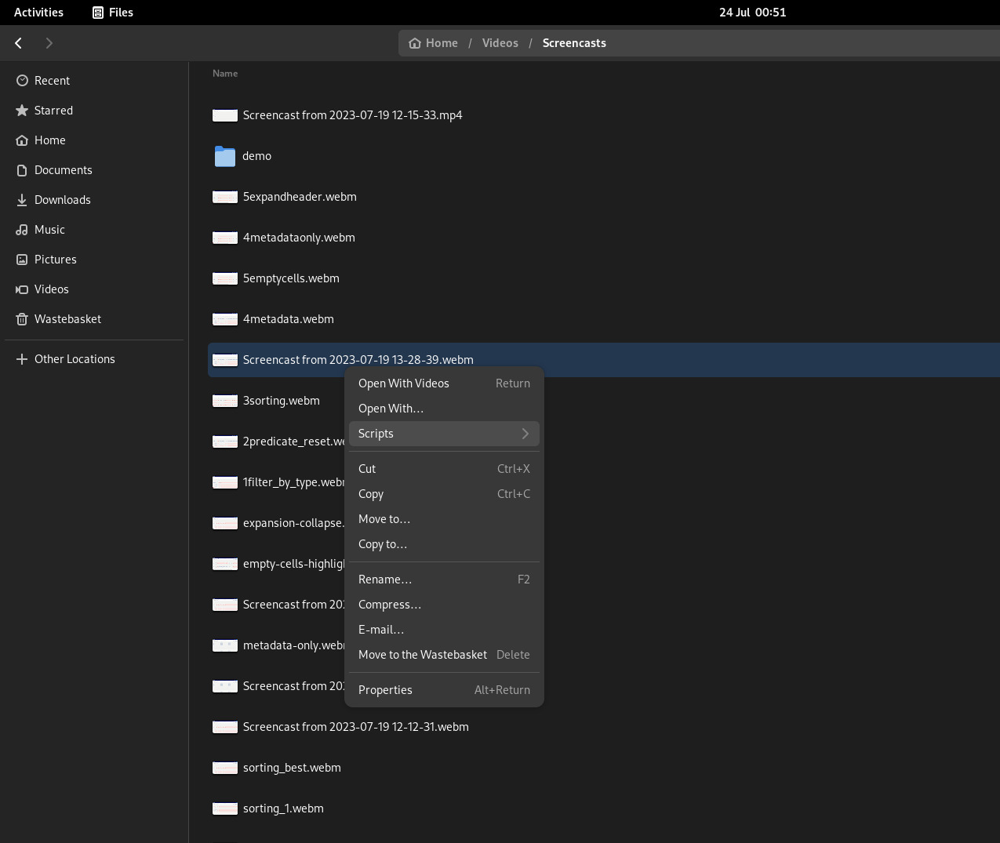
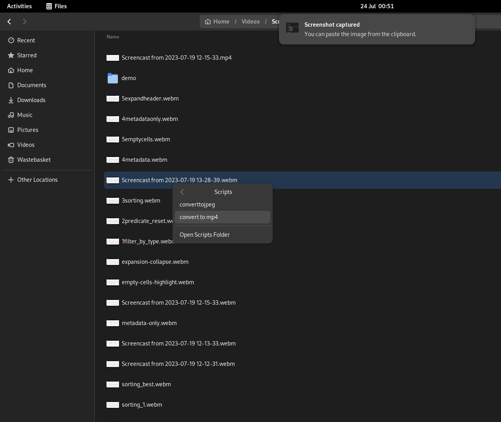

# Convert webm to mp4
Nautilus script to convert a screencast recorded in webm to mp4


## Installation

1. Copy the contents of the `convert to mp4` file in this repository to a file called `convert to mp4` inside your `~/.local/share/nautilus/scripts/` directory. One way of doing that is as follows:

    
```bash
git clone git@github.com:Dinika/convert-webm-to-mp4.git
cp convert\ to\ mp4 ~/.local/share/nautilus/scripts/ # Note the escaped spaces in the "convert to mp4" file.
```

2. Make the file executable:
```
cd ~/.local/share/nautilus/scripts/
chmod +x convert\ to\ mp4
```

3. Test the script. Right click on a file inside the "files" (a.k.a nautilus) application. Under the Scripts option, you should see another option called "convert to mp4". Clicking this option should run this script. If the file you selected was a `webm` or `mp4` file, it should be converted to an mp4 file. Otherwise you should see a warning message.





## NOTE

You can choose to call the file `convert to mp4` anything you want. The name of this file is the "label" that will show in the nautilus context menu that's why I went with the name above (even though it has spaces). It just felt a bit more human friendly to me.

## Troubleshooting

Unfortunately, the conversion to mp4 depends on some non-free drivers. If the script does not work, try installing them. On centos or fedora OS this can be done as follows

```bash
sudo dnf -y install https://download1.rpmfusion.org/nonfree/fedora/rpmfusion-nonfree-release-$(rpm -E %fedora).noarch.rpm
sudo dnf -y install https://download1.rpmfusion.org/free/fedora/rpmfusion-free-release-$(rpm -E %fedora).noarch.rpm
sudo dnf -y install ffmpeg
sudo dnf -y install ffmpeg --allowerasing
sudo dnf -y install ffmpeg-devel
sudo dnf install gstreamer1-plugins-{bad-\*,good-\*,base} gstreamer1-plugin-openh264 gstreamer1-libav --exclude=gstreamer1-plugins-bad-free-devel
sudo dnf install lame\* --exclude=lame-devel
sudo dnf group upgrade --with-optional Multimedia
```

## License

This software is distributed under GNU GENERAL PUBLIC LICENSE (GPL Version 3)
